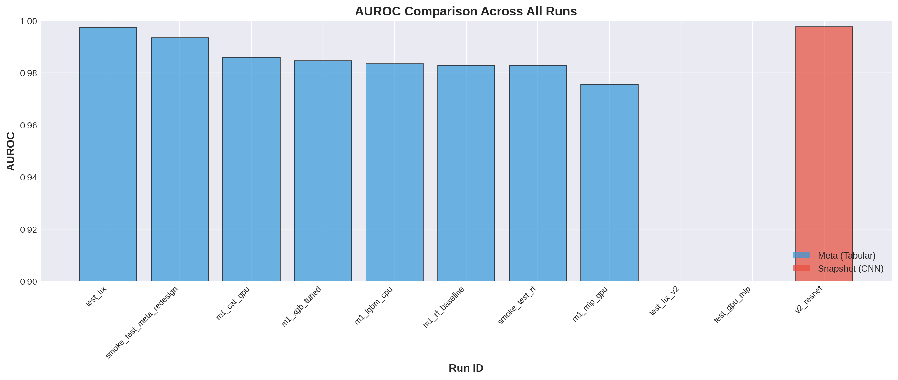

# SDT RB Classifier — Real/Bogus Classification for 7-Dimensional Telescope

7-Dimensional Telescope(7DT)의 transient science를 위한 real/bogus 분류기 학습 및 비교 연구.

## 개요

Intensive Monitoring Survey (IMS) 영역에서 생성된 science image와 subtracted image를 기반으로 semi-labeling을 수행하였다:
- **Real source**: science image 내 isolated source
- **Bogus source**: subtracted image에서 detection된 모든 source

두 가지 입력 방식으로 학습한 분류기의 성능을 비교·분석한다:

| 입력 방식 | 설명 |
|---|---|
| **Snapshot** | 천체 주변 cutout 이미지 (I/O 비용 큼) |
| **Meta** | SExtractor/PSFEx 메타데이터만 사용 (경량) |

**핵심 목적**: snapshot CNN 모델을 meta-only 모델로 대체할 수 있는지 다양한 알고리즘(LightGBM, XGBoost, CatBoost, MLP, Random Forest, ResNet, EfficientNet 등)을 통해 검증.

## 결과 요약



Meta(tabular) 모델들이 Snapshot(CNN) 모델과 동등하거나 더 높은 AUROC를 달성하였으며, I/O 비용이 큰 snapshot 없이도 효과적인 real/bogus 분류가 가능함을 확인.

| Model | AUROC | F1 (Macro) | Accuracy |
|---|---|---|---|
| CatBoost (GPU) | 0.986 | 0.974 | 0.990 |
| LightGBM (CPU) | 0.984 | 0.973 | 0.990 |
| XGBoost (tuned) | 0.985 | 0.974 | 0.990 |
| MLP (GPU) | 0.976 | 0.973 | 0.990 |
| ResNet (v2, CNN) | ~0.997 | ~1.00 | — |

## 데이터

- **IMS 관측 영역**: T00138, T00139, T00174, T00175, T00176, T00215, T00216
- **총 샘플 수**: ~44,700 (real 299, bogus 44,427)
- 샘플 데이터: [`data/meta_sample50.csv`](data/meta_sample50.csv) (50행 예시)
- 전체 학습 데이터는 용량 문제로 미포함 (stacked_meta, raw catalogs 등)

## 프로젝트 구조

```
.
├── script/                  # 전처리·학습·분석 스크립트
│   ├── 01_Run_PSFEx_SEx.py
│   ├── 02_Split_Meta_and_Snapshot.py
│   ├── 03_Stack_Catalogs.py
│   ├── 03_Normalize_Snapshots.py
│   ├── 04_Train_Test_Validate_Metas.py
│   ├── 04_Train_Test_Validate_Snapshots.py
│   └── 04_Train_Test_Validate_MultiModal.py
├── src/
│   ├── dataset.py           # Dataset 클래스
│   └── model.py             # 모델 정의
├── notebook/                # 분석 노트북
│   ├── 99_Summary_Compare_Results.ipynb
│   └── Tutorial_Meta.ipynb
├── config/                  # PSFEx/SExtractor 설정
├── data/
│   ├── meta_sample50.csv    # 50행 샘플 (real 25 + bogus 25)
│   ├── split/               # Tile별 train/val/test split 정보
│   └── note.txt
└── output/
    ├── summary/figures/     # 비교 그림
    └── meta/                # 학습된 meta 모델 및 메트릭
```

## 환경

```bash
pip install lightgbm xgboost catboost pytorch-lightning scikit-learn pandas numpy
```

## 사용법

```bash
# 1. 카탈로그 스택
python script/03_Stack_Catalogs.py

# 2. Meta 모델 학습
python script/04_Train_Test_Validate_Metas.py --model lgbm --device cpu

# 3. Snapshot 모델 학습
python script/04_Train_Test_Validate_Snapshots.py --arch resnet18

# 4. 결과 비교
jupyter notebook notebook/99_Summary_Compare_Results.ipynb
```
